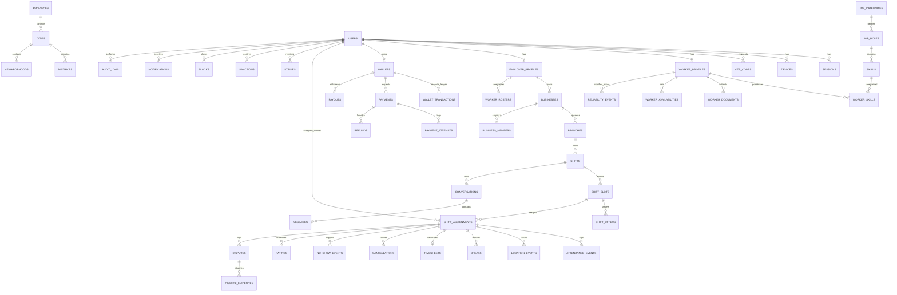

# KarAan (کارآن) - Database Architecture & ERD Documentation

This document describes the full PostgreSQL + PostGIS database architecture, entities, relationships, indexes, constraints, and financial ledger rules for the KarAan platform.

---

## 📐 Entity Relationship Diagram (ERD)

---

## 🏛 Entities Summary (48 Tables)

### 1. Identity & Auth (`users`, `sessions`, `devices`, `otp_codes`)
- `users`: Core identity table with `phone`, `role` (`WORKER`, `EMPLOYER`, `ADMIN`), `fullName`, `isVerified`, `isBlocked`, `deletedAt`.
- `sessions`: Bearer tokens & session expiry tracking.
- `devices`: Push notification tokens and device platforms (`IOS`, `ANDROID`, `WEB`).
- `otp_codes`: Short-lived SMS verification codes.

### 2. Geo Taxonomy (`provinces`, `cities`, `districts`, `neighborhoods`)
- Stores Iran's administrative boundaries and city lat/long points for radial matching.

### 3. Worker Domain (`worker_profiles`, `worker_documents`, `worker_availabilities`, `job_categories`, `job_roles`, `skills`, `worker_skills`)
- `worker_profiles`: Contains `hourlyRateRials` (BigInt), `homeLatitude`/`homeLongitude`, `reliabilityScore` (Decimal), and IBAN bank info.
- `worker_documents`: KYC compliance (`NATIONAL_ID`, `DRIVING_LICENSE`, `HEALTH_CARD`).
- `worker_availabilities`: Recurring day-of-week & date-specific availability slots.

### 4. Employer Domain (`employer_profiles`, `businesses`, `branches`, `business_members`)
- `employer_profiles`: Wallet balance & locked escrow reserves.
- `businesses` & `branches`: Company locations with PostGIS geography coordinates.

### 5. Shift Management (`shifts`, `shift_slots`, `shift_offers`, `shift_assignments`)
- `shifts`: Primary shift entity containing geofence radius, hourly pay rate, total budget (BigInt), `startAt` (UTC), `endAt` (UTC), `status`.
- `shift_assignments`: Separate lifecycle state machine (`MATCHED` ➔ `SETTLED`).

### 6. Attendance & GPS (`attendance_events`, `location_events`, `breaks`, `timesheets`)
- `attendance_events`: GPS geofence validation during check-in/out.
- `timesheets`: Gross, break, and net worked minutes calculation.

### 7. Reliability & Discipline (`cancellations`, `no_show_events`, `reliability_events`, `strikes`, `sanctions`)
- Dynamic reliability score adjustment (+2 on completed shift, -10 late cancel, -25 no-show).

### 8. Financial Engine (`wallets`, `wallet_transactions`, `payments`, `payment_attempts`, `refunds`, `payouts`)
- **Rules**:
  - Money stored strictly as `BigInt` (Rials integer).
  - Idempotent `wallet_transactions` ledger — **NEVER HARD DELETED**.

### 9. System & Audit (`system_settings`, `audit_logs`)
- `audit_logs`: Immutable security audit record — **NEVER HARD DELETED**.

---

## ⚡ Indexing Strategy

1. **B-Tree Indexes**: Applied to all Foreign Keys, `status`, `workerId`, `businessId`, `branchId`, `shiftId`, `startAt`, `createdAt`.
2. **Spatial Geo Index**: GiST indexes on latitude & longitude spatial functions (`ST_DWithin`, `ST_Distance`).
3. **Unique Idempotency Indexes**: Unique indexes on `idempotency_key` in `wallet_transactions` and `payments`.
